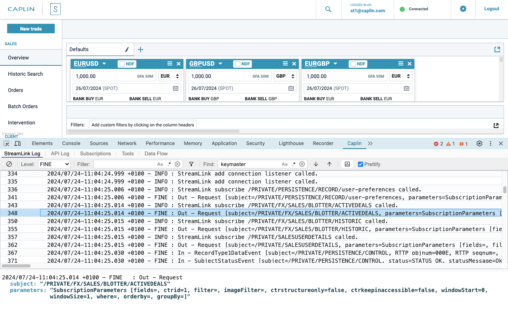

# Caplin StreamLink Developer Tools

Caplin StreamLink Developer Tools is an extension that helps developers debug their StreamLink applications.

**Note: this extension should only be used during development.**




Features:
- StreamLink Log: The StreamLink log with filtering, find and detail view
- API Log: A list of all calls and callbacks to/from the StreamLink API
- Subscriptions: A list of the current subscriptions and their values
- Tools: Tools to intercept messages, add extra subscriptions and log specific messages to the console.
- Data Flow: A graph of the data sent/received for the last minute

Notes:
- All Tables can be sorted
- Logs and subscription data tables have 'Show Detail' toolbar buttons
- Double click on a subscription will filter the API Log to show just related lines
- Logs will show the last 10,000 lines
- Logs will stick to bottom for a tail type display
- Use the usual keyboard shortcuts (ctrl-a, ctrl-c etc) to copy to the clipboard from the logs
- Tabs can be dragged to re-arrange the gui

## Deployment

Caplin StreamLink Developer Tools can be deployed in multiple ways:

1. As a Chrome extension from the Chrome store

2. As a separate web page launched from the same origin

3. As a Chrome extension loaded from your file system using developer mode

4. As a locally served Chrome extension (.crx file)

In all cases your StreamLink application must be modified 
to [enable Developer Tools](#enable-developer-tools-in-your-application), this wraps the StreamLink instance to allow messages to be intercepted.


### 1. As a Chrome extension from the Chrome store

  Install the extension from: https://chromewebstore.google.com/detail/caplin-developer-tools/kjkdjjoccokffopdpmhdkghcejhmjlfo

### 2. As a separate webpage launched from the same origin

Download this repo, serve the contents of the webpage directory from the same origin as your StreamLink application (same origin needed since they will communicate using Broadcast channels) then modify the way the StreamLink instance is wrapped to include a second parameter, the location of the background worker [(see below)](#enable-developer-tools-in-your-application). The developer tools gui is then accessed via the webpage served from the webpage/caplin-devtools-gui directory.


### 3. As a Chrome extension loaded from your file system using developer mode

Download this repo, go to the [Chrome extensions page](chrome://extensions/) in your browser, enable developer mode (the button in the top right corner), use the 'Load unpacked' button and select the chrome-extension/extension directory, this will load the extension in developer mode.

### 4. As a locally served Chrome extension (.crx file)

Download this repo, go to the [Chrome extensions page](chrome://extensions/) in your browser, enable developer mode (the button in the top right corner), then choose the 'Pack extension' button and use the chrome-extension/extension directory for the 'Extension root directory', this will create a .crx file containing the extension that can be hosted locally.

## Enable Developer Tools In Your Application

To enable developer tools in your StreamLink application:
```
    npm install @caplin/streamlink-devtools --save-dev
```
add the following line to the js/ts file that creates the StreamLink object
```
    import {withDevTools} from "@caplin/streamlink-devtools";
```
after creating the StreamLink object wrap it using withDevTools():
```
    const unwrappedStreamlink = caplin.streamlink.StreamLinkFactory.create(config);
    const streamlink = withDevTools(unwrappedStreamlink);

    // or if using the webpage version add the webworker location
    // const streamlink = withDevTools(streamlink, "caplin-devtools-webworker.js");
```
use the wrapped StreamLink throughout your application

